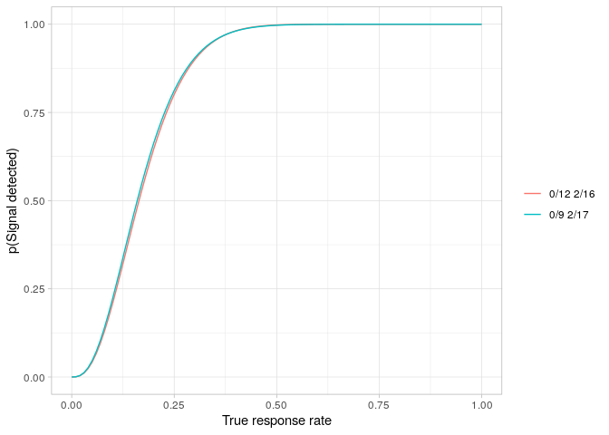
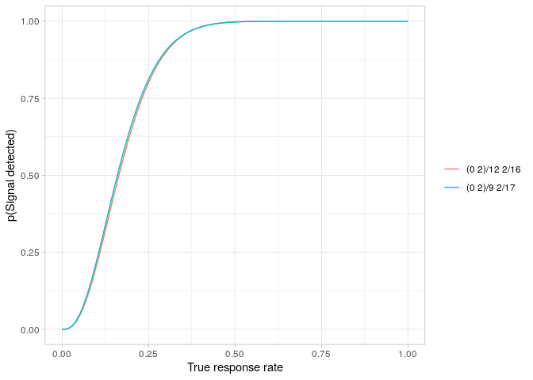
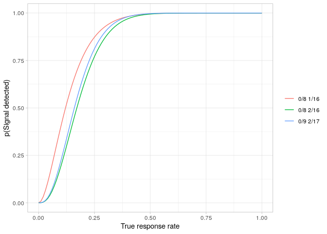

<!-- README.md is generated from README.Rmd. Please edit that file -->

# mtdesign

<!-- badges: start -->

[](https://CRAN.R-project.org/package=mtdesign)
[](https://github.com/openpharma/mtdesign/blob/_xml_coverage_reports/data/main/coverage.xml)
<!-- badges: end -->

## Introduction

The package `mtdesign` provides implementations of both Simon (1989) and
Mander & Thompson (2010). Other implementations of Simon’s methods are
available - for example, the `ph2simon` function in the `clinfun`
package (Seshan 2018), but these do not provide easy access to
non-optimal solutions in the way that `mtdesign` does. I am not aware of
any other R-based implementations of Mander & Thompson’s extension to
Simon.

## Installation

Once available on CRAN, you can install `mtdesign` in the usual way:

`install.packages("mtdesign")`

You can install the development version of `mtdesign` from
[GitHub](https://github.com/openpharma/mtdesign) with:

`devtools::install_github("openpharma/mtdesign")`

## Set up vignette environment

``` r
# By policy, on CRAN, use only two cores, no matter how many are available.
if (requireNamespace("parallel", quietly = TRUE)) {
  maxCores <- parallel::detectCores()
  maxCores <- ifelse(identical(Sys.getenv("NOT_CRAN"), "true"), maxCores, min(maxCores, 2))
} else {
  maxCores <- 1
}
```

## Example

Suppose that treatments with a response rate of less than 5% are of no
interest but those with a response rate of at least 25% are worthy of
further development. A Simon’s 2-stage design to seek an efficacy signal
with a significance level of 5% and a power of 80% is required.

``` r
library(mtdesign)
library(knitr)
library(dplyr)
#> 
#> Attaching package: 'dplyr'
#> The following objects are masked from 'package:stats':
#> 
#>     filter, lag
#> The following objects are masked from 'package:base':
#> 
#>     intersect, setdiff, setequal, union

simonDesign <- obtainDesign(p0 = 0.05, p1 = 0.25, alpha = 0.05, beta = 0.2, mander = FALSE, parallel = FALSE)

simonDesign %>%
  select(-Alpha, -Beta, -p0, -p1, -PETAlt, -AveSizeAlt) %>%
  kable(digits = c(0, 0, 0, 0, 3, 3, 2, 1, NA))
```

| nTotal | nStage1 | rTotal | rFutility | Type1 | Type2 | PETNull | AveSizeNull | Criterion |
|-------:|--------:|-------:|----------:|------:|------:|--------:|------------:|:----------|
|     17 |       9 |      2 |         0 | 0.047 | 0.188 |    0.63 |        12.0 | optimal   |
|     16 |      12 |      2 |         0 | 0.043 | 0.199 |    0.54 |        13.8 | minimax   |

The table shows that the optimal design for these requirements is 0/9
2/17. The expected sample size is 12.0 and the probability of early
termination is 63%. The significance level actually achieved is 4.7% and
the power level achieved is 100% - 18.8% = 81.2%.

The power curves for both designs are easily plotted.

``` r
powerPlot(simonDesign)
```



Obtaining the equivalent Mander & Thompson designs requires only a small
change to the calls.

``` r
manderDesign <- obtainDesign(
  p0 = 0.05,
  p1 = 0.25,
  alpha = 0.05,
  beta = 0.2,
  cores = maxCores
)

manderDesign %>%
  select(-Alpha, -Beta, -p0, -p1) %>%
  kable(digits = c(0, 0, 0, 0, 3, 3, 2, 2, 2, 1, NA))
```

| nTotal | nStage1 | rTotal | rFutility | rSuccess | Type1 | Type2 | PETNull | PETAlt | AveSizeNull | AveSizeAlt | Criterion   |
|-------:|--------:|-------:|----------:|---------:|------:|------:|--------:|-------:|------------:|-----------:|:------------|
|     17 |       9 |      2 |         0 |        2 | 0.047 |  0.19 |    0.64 |   0.47 |        11.9 |         NA | optimalNull |
|     16 |      12 |      2 |         0 |        2 | 0.043 |  0.20 |    0.56 |   0.64 |        13.8 |         NA | minimaxNull |
|     17 |       9 |      2 |         0 |        2 | 0.047 |  0.19 |    0.64 |   0.47 |        11.9 |         NA | optimalAlt  |
|     16 |      12 |      2 |         0 |        2 | 0.043 |  0.20 |    0.56 |   0.64 |        13.8 |         NA | minimaxAlt  |

``` r
powerPlot(manderDesign)
```



### Constrained designs

Suppose a trial, for whatever reason, is restricted to using 8
participants in each stage. As shown above, the optimal Simon’s two
stage design is 0/9 2/17. That’s close to n<sub>1</sub> = 8, n = 16. Is
there a (slightly) sub-optimal design that has n<sub>1</sub> = 8, n =
16?

``` r
x <- createGrid(p0 = 0.05, p1 = 0.25, alpha = 0.05, beta = 0.2, mander = FALSE)

y <- x %>% filter(nStage1 == 8, nTotal == 16)
z <- y %>% obtainDesign(cores = maxCores)
#> Warning: No acceptable designs were found.
if (nrow(z) == 0) {
  print("No acceptable designs were found.")
} else {
  select(-Alpha, -Beta, -p0, -p1, -PETAlt, -AveSizeAlt) %>%
    z() %>%
    select(-Alpha, -Beta, -p0, -p1, -PETAlt, -AveSizeAlt) %>%
    kable(digits = c(0, 0, 0, 0, 3, 3, 2, 1, NA))
}
#> [1] "No acceptable designs were found."
```

No, there isn’t. How close can we get?

``` r
z1 <- y %>% augmentGrid()

bestSize <- z1 %>%
  filter(Type1 < Alpha) %>%
  slice_min(Type2)
bestSize %>%
  select(-Alpha, -Beta, -p0, -p1, -PETAlt, -AveSizeAlt) %>%
  kable(
    caption = "Best sub-optimal design with required significance level",
    digits = c(0, 0, 0, 0, 3, 3, 2, 1, NA)
  )
```

| nTotal | nStage1 | rTotal | rFutility | Type1 | Type2 | PETNull | AveSizeNull |
|-------:|--------:|-------:|----------:|------:|------:|--------:|------------:|
|     16 |       8 |      2 |         0 | 0.039 | 0.229 |    0.66 |        10.7 |

Best sub-optimal design with required significance level

``` r
bestPower <- z1 %>%
  filter(Type2 < Beta) %>%
  slice_min(Type1)

bestPower %>%
  select(-Alpha, -Beta, -p0, -p1, -PETAlt, -AveSizeAlt) %>%
  kable(
    caption = "Best sub-optimal design with required power",
    digits = c(0, 0, 0, 0, 3, 3, 2, 1, NA)
  )
```

| nTotal | nStage1 | rTotal | rFutility | Type1 | Type2 | PETNull | AveSizeNull |
|-------:|--------:|-------:|----------:|------:|------:|--------:|------------:|
|     16 |       8 |      1 |         0 | 0.151 | 0.127 |    0.66 |        10.7 |

Best sub-optimal design with required power

So the choice lies between a design which achieves the required
significance level but has a power of only 77.1% or one which has the
required power but which has a significance level of 15.1%. Both designs
accept the null hypothesis when no responders are seen in the first
group of eight participants. They differ in the critical value at the
end of stage 2: 1 to maintain the power, 2 to maintain the significance
level.

The power curve for each of these designs can be compared with that for
the globally optimal design.

``` r
plotData1 <- simonDesign %>%
  filter(Criterion == "optimal") %>%
  bind_rows(list(bestSize, bestPower))
powerPlot(plotData1)
```



## Package structure

The `mtdesign` package consists of three main functions:

-   `createGrid` creates the grid (of nStage1, rFutility, nTotal and
    rTotal for Simon’s design or nStage1, rFutility, rSuccess, nTotal
    and rTotal for a Mander & Thompson design) over which the brute
    force search for the required design(s) is conducted
-   `augmentGrid`takes a grid created by `createGrid` and adds columns
    for probability of early termination, Type 1 error, Type 2 error and
    expected sample size to it.
-   `obtainDesign` takes an augmented grid and identifies the optimal
    and minimax designs

## Error and warning messages and logging

The `mtdesign` package supports logging via the `futile.logger` package
(Rowe 2016). Most functions simply report Entry and Exit at the `DEBUG`
level.

The `augmentGrid` function reports steps of the parallelisation process
at the `TRACE` level.

## Parallelisation

There is no known closed form solution to obtaining solutions to either
Simon’s original equations nor Mander & Thompson’s extensions. The
`mtdesign` package uses a brute force approach to evaluate the operating
characteristics of all reasonable potential designs. The grids can be
quickly become large, particularly for Mander & Thompson designs. For
example, `createGrid(0.2, 0.4, alpha=0.1, beta=0.1)` creates a grid of
almost 11 million candidate designs. `mtdesign` uses paralellisation to
attempt to speed up the evaluation of candidate designs.

The `augmentGrid` function allows users some control over the
parallelisation process:

-   The `parallel` parameter defaults to `TRUE` and defines whether or
    not paralellisation is to be used.
-   The `cores` parameter specifies how many cores are to be used. The
    default value, `NA` tells `mtdesign` to use all available (as
    defined by `parallel::detectCores()`), cores.
-   The `minChunkSize` determines the smallest grid of candidate designs
    that will trigger paralellisation. The default value is `100000`.

The `parallel` package is required for parallelisation. If
parallelisation is both needed (ie the grid size exceeds `minChunkSize`)
and requested but the `parallel` package has not been installed, an
error message is thrown and augmentation of the grid stops. If
paralellisation is not requested and the grid contains one million or
more rows, a warning is produced.

## Troubleshooting

If, when installing or using the `mtdesign` package, you get an error
regarding a syntax error in an`.hpp` file, similar to the following

``` r
.../BH/include/boost/math/tools/fraction.hpp:84:48: error: ‘long double’ is not a class, struct, or union type using value_type = typename T::value_type;
```

the issue is most likely a mismatch between the g++ compiler being used
and the headers supplied by the `BH` package. There are only two
solutions that I know of:

-   Upgrade g++
-   Downgrade the version of the `BH` package you are using. The
    appropriate package version depends on the version of the g++
    compiler you are using.

## References

<div id="refs" class="references csl-bib-body hanging-indent">

<div id="ref-MANDER" class="csl-entry">

Mander, AP, and Thompson, SG. 2010. “Two-Stage Designs Optimal Under the
Alternative Hypothesis for Phase II Cancer Clinical Trials.”
*Contemporary Clinical Trials* 31 (6): 572–78.
https://doi.org/<https://www.doi.org/10.1016/j.cct.2010.07.008>.

</div>

<div id="ref-LOGGER" class="csl-entry">

Rowe, Brian Lee Yung. 2016. *Futile.logger: A Logging Utility for r*.

</div>

<div id="ref-CLINFUN" class="csl-entry">

Seshan, VE. 2018. “Clinfun: Clinical Trial Design and Data Analysis
Functions.” Software. <https://CRAN.R-project.org/package=clinfun>.

</div>

<div id="ref-SIMON" class="csl-entry">

Simon, R. 1989. “Optimal Two-Stage Designs for Phase II Clinical
Trials.” *Controlled Clinical Trials* 10 (1): 1–10.
https://doi.org/<https://www.doi.org/10.1016/0197-2456(89)90015-9>.

</div>

</div>
